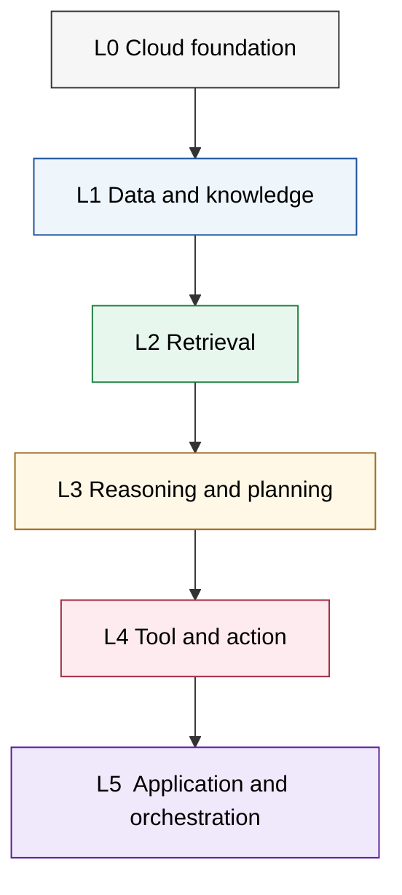

# Figure 7 — TERA Framework (three sub-panels)

Figure 7 is the article's signature visualization. It is presented as three composed sub-panels (a), (b), (c) under a single figure number to fit the IEEE Access two-column page width while preserving the framework's structural argument. Each sub-panel has a Mermaid source where applicable plus a structured visual description for production drawing in the diagramming tool of choice (draw.io is recommended for the final master).

---

## Figure 7(a) — Stacked layered view (L0–L5)

**Source:** `figure-07a-tera-layers.mmd`

The six bands are stacked bottom-to-top with bands sized in proportion to the engineering surface they cover. L0 is widest at the base; L5 is narrowest at the top. Each band's label includes a one-line summary of its components (drawn from Section 9 of the manuscript / `cloud-reference-architecture/components.csv`).

---

## Figure 7(b) — Cross-cutting concerns view (C1–C5)

**Source:** `figure-07b-tera-concerns.drawio` (text spec below)

Five vertical translucent columns are overlaid on the L0–L5 stack from sub-panel (a). Columns left-to-right are:

- **C1 — Security and privacy.** Annotations: structured queries, policy engine, prompt-injection detection, output safety classifier, secret broker, network boundary.
- **C2 — Evaluation.** Annotations: RAGAS, ARES, SYNCHECK, agent capability benchmarks, adversarial benchmarks (Agent Security Bench, AgentDojo), CI/CD eval gate.
- **C3 — Observability and telemetry.** Annotations: OpenTelemetry GenAI traces, retrieval and plan and tool spans, drift detectors.
- **C4 — Governance and human oversight.** Annotations: policy engine, approval queue, audit log store, evidence artifacts.
- **C5 — LLMOps and continuous improvement.** Annotations: GitOps, eval-gated promotion, rollback runbook, cost SLO.

Each column is a translucent fill so that the layered structure of (a) shows through. The intersection of each (Lx, Cy) cell is the unit of analysis prescribed by Table 10 (TERA grid).

---

## Figure 7(c) — Worked example overlay: editorial and content-analytics deployment

**Source:** `figure-07c-tera-editorial-overlay.drawio` (text spec below)

The same 6 × 5 grid as (b) with concrete deployment choices marked in six named cells:

| Cell | Deployment choice |
|---|---|
| L0 × C1 | Hybrid cloud topology with on-premise article archive; per-tenant cache namespacing at the LLM gateway; KMS-managed embedding-store credentials |
| L1 × C4 | Provenance graph from chunk to citation tied to existing editorial source-verification workflow; permissive PII handling for public sources |
| L2 × C2 | Hybrid retrieval with editorial fact-check fixtures as the CI eval set; RAGAS faithfulness gate per build; SYNCHECK on a sampled fraction of online traffic |
| L3 × C1 | Structured-query input boundary; PromptShield-class prompt-injection detection; multi-turn safety probes (Crescendo, TwinBreak) at release |
| L4 × C1 / C4 | CMS-read but no CMS-write tool access; tool registry hash-pinned; HITL approval gate before any auto-published correction |
| L5 × C5 | GitOps with eval-gated promotion; rollback to prior agent on faithfulness regression; per-query cost budget |

Cells outside the named six are shaded lighter to indicate moderate rather than maximal investment, consistent with the deployment's advisory-to-assisted autonomy at business-critical risk. Cells with no investment are shown unshaded and labeled as documented residual risk (e.g., L4 × C1 for a hypothetical CMS-write extension).

---

## Production notes

- (a) renders directly from Mermaid; export at 300 DPI vector PDF.
- (b) and (c) are best authored in draw.io for the translucent-overlay effect; the text spec above is sufficient for an artist or the author to render.
- Color palette uses the Wong colorblind-friendly set throughout.
- Caption ≤ 75 words covering all three sub-panels.
- Final figure source files committed to this directory before the Zenodo archive.
